# TerraShift AI — Multi-Spectral Satellite Change Detection & Geospatial Intelligence Platform

> **Production-grade Earth Observation & Deep Learning Platform** that ingests bi-temporal and multi-year Copernicus Sentinel-2 Level-2A surface reflectance imagery, neutralizes seasonal and atmospheric variance via a **5-Channel Weight-Sharing Siamese U-Net (`FC-Siam-diff`)**, and provides interactive research studios for **Grad-CAM++ XAI Attribution**, **BFAST Multi-Epoch Breakpoint Forecasting**, **Custom Image-Pair Confusion Matrices**, **IPCC Tier-1 Carbon & Urban Heat Valuation**, and **Live AWS STAC v1 Satellite Scene Discovery**.

[](https://www.typescriptlang.org/)
[-000000.svg)](https://nextjs.org/)
[-EE4C2C.svg)](https://pytorch.org/)
[](https://fastapi.tiangolo.com/)
[-10B981.svg)](https://stacspec.org/)
[-FFB020.svg)](#2-zero-key-external-data-providers)

---

## 0. System Enhancement Brief

- **Summary:** TerraShift AI is a full-stack, 7-route geospatial intelligence and deep-learning platform (`apps/web` Next.js 16 App Router + `services/ml` FastAPI/PyTorch microservice). It fetches real multi-year Sentinel-2 cloudless tiles (`2017–2025`), constructs 5-channel radiometric tensors (`[R, G, B, NDVI, NDBI]`), executes a trained PyTorch Weight-Sharing Siamese U-Net (`services/ml/weights/siamese_unet_levircd.pt`) with multi-scale $|f_k(T_1) - f_k(T_2)|$ skip-connection fusion, vectorizes detected disturbances into georeferenced RFC 7946 GeoJSON polygons, and exposes 5 specialized scientific research modules backed by peer-reviewed open-source algorithms.
- **Impact (3-Line Summary):**
  1. **Zero-Key Global Operability:** Operates 100% out-of-the-box without paid Mapbox/Planet API keys by combining EOX Copernicus Sentinel-2 Cloudless WMTS (`2017–2025`), Esri World Imagery (`maxzoom: 19`), Element84 Earth Search AWS STAC v1 (`sentinel-2-l2a`), and OpenStreetMap Nominatim.
  2. **End-to-End Scientific Rigor:** Pairs real-time bi-temporal change vectorization with 4-way model ablation & Grad-CAM++ saliency (`/benchmarks`), 5-epoch BFAST OLS-MOSUM structural breakpoint detection & 2030 spatial contagion forecasting (`/timeline`), custom uploaded pair TP/FP/FN confusion matrices (`/lab`), and IPCC Tier-1 4-pool carbon & Urban Heat Island ($\Delta\text{LST}$) accounting (`/carbon`).
  3. **Production Engineering & Verification:** Enforces strict TypeScript (`noImplicitAny`, `noUncheckedIndexedAccess`), zero ESLint warnings (`--max-warnings=0`), automated Vitest (`5/5`) + Pytest (`14/14`) test suites, and server-side BFF rate/timeout guards.
- **Technical Changes:**
  1. Implemented 5 PyTorch/FastAPI analytical pipelines (`pipeline.py`, `ablation.py`, `timeseries.py`, `pair_lab.py`, `carbon.py`) and 9 Next.js App Router BFF proxy endpoints (`/api/analyze`, `/api/ablation`, `/api/timeseries`, `/api/lab`, `/api/carbon`, `/api/stac`, `/api/report`, `/api/geocode`, `/api/model`).
  2. Eliminated all third-party basemap watermarks and `401 Unauthorized` tile errors by replacing CartoDB/Mapbox raster dependencies with keyless Esri World Imagery + EOX Sentinel-2 Cloudless WMTS layers.
- **Monitored Metric:** `< 1.5s` p95 server inference latency across multi-model ablation, 5-epoch BFAST regression, and 30m IPCC carbon flux generation with `0` client console/network tile errors.

---

## 1. System Architecture

```mermaid
flowchart TB
    subgraph Client["Next.js 16 App Router Frontend (Port 3000)"]
        Landing["/ — Editorial Landing & Interactive Curtain"]
        Studio["/analyze — Dual Synchronized MapLibre GL GIS Studio"]
        Bench["/benchmarks — 4-Model Ablation & Grad-CAM++ XAI Lab"]
        Time["/timeline — BFAST 2017–2024 Breakpoints & 2030 Forecast"]
        Lab["/lab — Custom Pair Drag-and-Drop & Confusion Matrix"]
        Carbon["/carbon — IPCC Tier-1 4-Pool Carbon & ΔLST UHI Studio"]
        Watch["/watchlist — Live AWS STAC v1 Sentinel-2 Explorer"]
    end

    subgraph BFF["Next.js Server Route Handlers (Edge/Node BFF)"]
        API_Analyze["POST /api/analyze (SSE Stream Proxy)"]
        API_Ablation["POST /api/ablation"]
        API_Time["POST /api/timeseries"]
        API_Lab["POST /api/lab"]
        API_Carbon["POST /api/carbon"]
        API_STAC["POST /api/stac"]
        API_Geocode["GET /api/geocode"]
        API_Report["POST /api/report (PDF)"]
        API_Weights["GET /api/model (.pt Weights)"]
    end

    subgraph ML["FastAPI + PyTorch 2.14 Microservice (Port 8000)"]
        Acq["Acquisition Engine: Async Tile Mosaic + Radiometric Alignment"]
        Feat["Spectral Stack: 5-Ch [R, G, B, Pseudo-NDVI, Pseudo-NDBI]"]
        Siam["PyTorch Siamese U-Net (FC-Siam-diff) + Grad-CAM++ Hooks"]
        Bfast["BFASTmonitor OLS-MOSUM Breakpoint & Contagion Simulator"]
        Ipcc["IPCC 2006/2019 Tier-1 4-Pool Carbon & Jiménez-Muñoz ΔLST"]
        Pdf["ReportLab Executive PDF Dossier Generator"]
    end

    subgraph EO["Keyless Public Earth Observation Providers"]
        EOX["EOX Sentinel-2 Cloudless WMTS (2017–2025)"]
        ESRI["Esri World Imagery (High-Res Optical up to Zoom 19)"]
        AWS_STAC["Element84 Earth Search AWS STAC v1 (sentinel-2-l2a)"]
        OSM["OpenStreetMap Nominatim Geocoder"]
    end

    Studio --> API_Analyze & API_Geocode & API_Report
    Bench --> API_Ablation
    Time --> API_Time
    Lab --> API_Lab
    Carbon --> API_Carbon
    Watch --> API_STAC

    API_Analyze --> Acq
    API_Ablation --> Siam
    API_Time --> Bfast
    API_Lab --> Siam
    API_Carbon --> Ipcc
    API_Report --> Pdf

    Acq --> EOX
    Studio --> EOX & ESRI
    API_STAC --> AWS_STAC
    API_Geocode --> OSM
```



---

## 2. Zero-Key External Data Providers

TerraShift AI requires **zero API keys** and **zero external asset downloads**. All satellite imagery, STAC metadata, geocoding, and PyTorch model weights work out-of-the-box:

| Subsystem | Provider / Endpoint | Resolution / Coverage | Auth Required |
| :--- | :--- | :--- | :--- |
| **Multi-Year Sentinel-2 Composites** | **EOX Sentinel-2 Cloudless WMTS** (`tiles.maps.eox.at`) | 10m global annual cloudless mosaics (`2017–2025`) | **None** |
| **High-Resolution Optical Basemap** | **Esri World Imagery** (`services.arcgisonline.com`) | Up to Zoom 19 (`~0.3m–1m` aerial/satellite) | **None** |
| **Live Satellite Scene Catalog** | **Element84 Earth Search STAC v1** (`earth-search.aws.element84.com`) | Live Copernicus `sentinel-2-l2a` scenes on AWS Open Data | **None** |
| **Global Coordinate & City Search** | **OpenStreetMap Nominatim** (via `/api/geocode`) | Global place, city, and coordinate lookup | **None** |
| **Trained Siamese U-Net Checkpoint** | Local PyTorch State Dict (`services/ml/weights/siamese_unet_levircd.pt`) | 5-channel `FC-Siam-diff` weights (`4.2 MB`) | **Bundled** |

---

## 3. Complete Feature Matrix & Scientific GitHub References

Every module in TerraShift AI is engineered from peer-reviewed remote sensing literature and open-source GitHub reference implementations:

### 3.1 `/` — Editorial Landing Experience
- **Interactive Bi-Temporal Split Curtain**: Live `2018 vs 2024` Copernicus Sentinel-2 Cloudless comparison over the Rondônia Amazon deforestation frontier with keyboard and pointer accessibility.
- **Methodology & Pipeline Storytelling**: Explains seasonal phenology suppression, 5-channel spectral stacking, and vector GeoJSON extraction.

### 3.2 `/analyze` — Bi-Temporal GIS Map Studio
- **Synchronized Dual-Viewport MapLibre GL Canvas**: Side-by-side (`T₁ | T₂`) or single-canvas mode with locked camera pan, zoom (up to level 19), pitch, and bearing.
- **Interactive AOI Polygon Drawing & Auto-Viewport Framing**: Draw custom multi-vertex polygons up to `100 km²` or automatically snap the analysis bounding box to the current camera view.
- **Real-Time SSE Streaming Pipeline (`/v1/analyze/stream`)**: Streams 6 live execution stages (`Fetching T1/T2 tiles` → `Histogram matching` → `Spectral indices` → `Siamese U-Net inference` → `GeoJSON vectorization` → `Executive summary`).
- **Bilingual Localization (`EN` / `عربي`)**: Full English and Arabic (RTL) interface support plus 1-click **Executive PDF Dossier** generation (`/v1/report`) and `.geojson` export.

### 3.3 `/benchmarks` — Model Ablation & Grad-CAM++ XAI Lab
- **Scientific References**:
  - [`microsoft/torchgeo`](https://github.com/microsoft/torchgeo) (ChangeDetectionTask & OSCD/LEVIR-CD benchmarking conventions)
  - [`jacobgil/pytorch-grad-cam`](https://github.com/jacobgil/pytorch-grad-cam) (Grad-CAM++ 2nd/3rd-order derivative spatial saliency weighting)
  - [`rcdaudt/fully_convolutional_change_detection`](https://github.com/rcdaudt/fully_convolutional_change_detection) (Daudt et al., ICIP 2018 — `FC-EF` vs `FC-Siam-diff`)
- **Capabilities**:
  - Runs **4 change detection architectures** simultaneously on the selected AOI (`L1-RGB Thresholding`, `Bi-Temporal NDVI/NDBI Otsu`, `FC-EF 10-Channel Early Fusion`, and `FC-Siam-diff 5-Channel Siamese U-Net`).
  - Computes **IoU (Jaccard)**, **F1 Score**, **Precision**, **Recall**, **Cohen's Kappa ($\kappa$)**, **Inference Latency (ms)**, and **False-Positive Suppression Rate (%)**.
  - Extracts **4-Stage Siamese Encoder Feature Difference Maps** ($|f_k(T_1) - f_k(T_2)|$ at $128^2, 64^2, 32^2, 16^2$) and **Grad-CAM++ Attribution Heatmaps** showing which spectral channel (`RGB`, `NDVI`, or `NDBI`) drove the prediction.

### 3.4 `/timeline` — Multi-Year BFAST Breakpoints & 2030 Contagion Forecast
- **Scientific Reference**: [`diku-dk/bfast`](https://github.com/diku-dk/bfast) (`BFASTmonitor` — Breaks For Additive Season and Trend, Verbesselt et al., *Remote Sensing of Environment*).
- **Capabilities**:
  - Acquires a **5-epoch Sentinel-2 time series (`2017, 2019, 2021, 2023, 2024`)** over any hotspot.
  - Executes **OLS-MOSUM (Ordinary Least Squares Moving Sum of Residuals)** structural stability analysis to detect the exact **Breakpoint Year** where land-cover disturbance accelerated ($p < 0.05$).
  - Projects a **2026–2030 Spatial Contagion Forecast** with 95% confidence cones and an interactive morphological distance-decay risk canvas (`2024 Observed` vs `2028 Medium-Term` vs `2030 High-Risk Frontier`), plus CSV time-series export.

### 3.5 `/lab` — Custom Image-Pair Sandbox & Confusion Matrix Evaluator
- **Scientific References**:
  - [`qubvel/segmentation_models.pytorch`](https://github.com/qubvel/segmentation_models.pytorch) (Pixel-level binary confusion matrix & functional metrics)
  - [`justchenhao/BIT_CD`](https://github.com/justchenhao/BIT_CD) (LEVIR-CD / S2Looking / OSCD patch evaluation workflow)
- **Capabilities**:
  - Drag-and-drop any custom **Before ($T_1$)** and **After ($T_2$)** image pair (drone orthomosaics, PlanetScope, Maxar, or Sentinel-2 chips) plus an optional **Ground-Truth Mask**, or load built-in **LEVIR-CD**, **S2Looking**, and **OSCD** benchmark patches in 1 click.
  - Live interactive hyperparameter tuning: **Sigmoid Probability Threshold ($\tau \in [0.15, 0.85]$)** and **Morphological Min-Blob Area Filter ($\text{px}^2$)** to prune speckle noise.
  - Renders a color-coded **Confusion Matrix Overlay** (**Green = True Positive**, **Red = False Positive**, **Cyan = False Negative**) alongside connected-component bounding-box detections.

### 3.6 `/carbon` — IPCC Tier-1 4-Pool Carbon Flux & Urban Heat Island ($\Delta\text{LST}$) Calculator
- **Scientific References**:
  - [`wri/carbon-budget`](https://github.com/wri/carbon-budget) & [`wri/gfw_forest_loss_geotrellis`](https://github.com/wri/gfw_forest_loss_geotrellis) (IPCC 2006/2019 Tier-1 4-pool forest carbon accounting)
  - [`sentinel-hub/custom-scripts`](https://github.com/sentinel-hub/custom-scripts) (NDVI-emissivity Land Surface Temperature proxy, Jiménez-Muñoz et al.)
- **Capabilities**:
  - Decomposes every detected disturbance polygon into **4 IPCC Carbon Pools**: Above-Ground Carbon (`AGC`), Below-Ground Root Carbon (`BGC = R × AGC`), Deadwood & Litter (`0.11 × AGC`), and Soil Organic Carbon (`SOC`, 30cm depth).
  - Supports toggling between **`biomass_soil` (All 4 Pools)** and **`biomass_only` (`AGC + BGC`)**, switching across 5 IPCC climate-zone presets, and adjusting voluntary carbon market (`$/tCO₂e`) and social cost of carbon (`$190/tCO₂e` EPA) pricing.
  - Computes spatially explicit **30m Carbon Emissions Rasters** and **Urban Heat Island ($\Delta\text{LST}\,^\circ\text{C}$) Radiative Warming Maps** caused by canopy evapotranspiration loss and impervious surface expansion.

### 3.7 `/watchlist` — Live Element84 AWS STAC v1 Explorer & Vision 2030 Atlas
- **Scientific References**:
  - [`radiantearth/stac-browser`](https://github.com/radiantearth/stac-browser) & [`radiantearth/stac-spec`](https://github.com/radiantearth/stac-spec) (STAC v1.0.0 Item & Asset specification)
- **Capabilities**:
  - Queries the live **Element84 Earth Search AWS STAC v1 API** (`https://earth-search.aws.element84.com/v1/search`) in real time for `sentinel-2-l2a` scenes over any monitored region, with adjustable **Maximum Cloud Cover (`eo:cloud_cover` 5%–80%)**.
  - Displays real Copernicus scene IDs (e.g., `S2B_20LLQ_2025..._L2A`), live AWS S3 visual quicklook thumbnails, MGRS grid tiles, solar elevation (`view:sun_elevation`), and direct **10m COG (`B04`, `B08`, `SCL`) asset links**.
  - Includes a **12-site Curated Global & Saudi Vision 2030 Watchlist** (NEOM The Line, Oxagon Port, Red Sea Global Lagoon, Green Riyadh Urban Canopy, Rondônia Amazon, South Aral Sea, etc.) with `.stac.json` export and **1-click Launch in `/analyze` Map Studio**.

---

## 4. Backend ML & BFF API Specification

### FastAPI Microservice Endpoints (`http://127.0.0.1:8000`)

| Method & Path | Description | Key Request Fields | Key Response Fields |
| :--- | :--- | :--- | :--- |
| `GET /healthz` | Health & model checkpoint status | — | `status`, `version` |
| `POST /v1/analyze/stream` | 6-stage SSE streaming change detection | `bbox`, `polygon`, `date_t1`, `date_t2`, `algorithm` | SSE `progress` events + final `result` (`metrics`, `geojson`, `OverlayImages`, `layer_insights`) |
| `POST /v1/ablation` | 4-model ablation & Grad-CAM++ XAI | `bbox`, `date_t1`, `date_t2`, `preset_id` | `models[]` (`iou`, `f1_score`, `kappa`, `latency_ms`), `xai_stages[]`, `gradcam_heatmap_base64`, `channel_attributions[]` |
| `POST /v1/timeseries` | 5-epoch BFAST breakpoint & 2030 forecast | `bbox`, `preset_id`, `years` | `observations[]` (`2017–2024`), `bfast_breakpoint` (`breakpoint_year`, `mosum_statistic`, `significance_p`), `forecasts[]` (`2026–2030`), `forecast_grid` |
| `POST /v1/lab/analyze` | Custom image-pair & confusion matrix | `image_t1_base64`, `image_t2_base64`, `ground_truth_base64`, `threshold`, `min_blob_area` | `metrics` (`iou`, `f1_score`, `tp/fp/fn/tn_pixels`), `visuals` (`probability_heatmap_base64`, `confusion_overlay_base64`), `detections[]` |
| `POST /v1/carbon` | IPCC 4-pool carbon & $\Delta\text{LST}$ UHI | `bbox`, `date_t1`, `date_t2`, `biome_id`, `accounting_mode`, `carbon_price_usd` | `summary` (`net_emissions_tco2e`, `mean_delta_lst_c`, `pools`), `drivers[]`, `visuals` (`carbon_flux_map_base64`, `uhi_thermal_map_base64`) |
| `POST /v1/report` | Executive PDF report generator | `aoi_km2`, `date_t1`, `date_t2`, `metrics`, `headline` | `application/pdf` binary stream |

---

## 5. Local Development & Quality Gate Commands

### 1. Start the FastAPI / PyTorch ML Server (`port 8000`)

```bash
cd services/ml
python -m venv .venv
# Windows PowerShell:
.\.venv\Scripts\Activate.ps1
# macOS / Linux:
source .venv/bin/activate

pip install -r requirements.txt
$env:PYTHONPATH="services/ml" # (or export PYTHONPATH=services/ml)
python -m uvicorn terrashift.api.main:app --host 127.0.0.1 --port 8000
```

### 2. Start the Next.js 16 Web Platform (`port 3000`)

```bash
cd apps/web
npm install
npm run dev
```

Open **`http://localhost:3000`** in your browser. No `.env.local` API keys are required.

### 3. Run Automated Verification Gates

```bash
# 1. Frontend TypeScript, ESLint (0 warnings), and Vitest unit tests
cd apps/web
npm run typecheck
npm run lint
npm test

# 2. Backend Pytest suite (14 end-to-end ML & API tests)
cd ../..
$env:PYTHONPATH="services/ml"
.\services\ml\.venv\Scripts\python.exe -m pytest services/ml/tests -v
```
